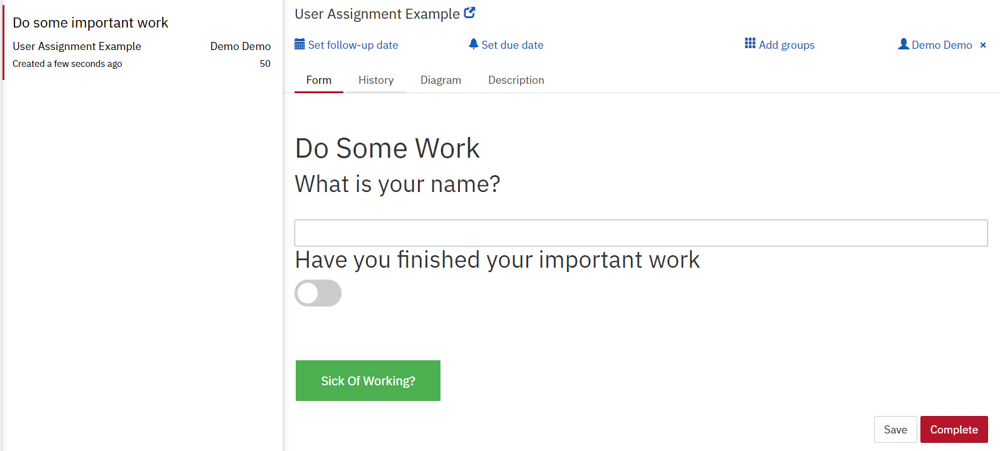

# Automatically Reassign User Tasks

This is an example to help understand a pretty common use case:
Wanting to unassigned all the currently active user tasks for a given process and 
re-assign them to another user.

In this example I've added the following features:
- Offer a user a button on any task so that they can unassigned the tasks and have someone else chose a new user
- Once a new assignees is picked all current and future tasks will be assigned that user.
- This pattern supports sub processes i.e. a user in a sub process can still trigger the reassignment
- The pattern supports parallel tasks. 

In this example we have the following process:


Each user task has more or less the same front end which has a little toggle to indicate that work has
been done but more importantly a button that a user can press when they're sick of working.



When the ``Sick of Working`` button is clicked it triggers an uninterrupting escalation event.
This is done quite easily in the form itself
```XML
 <button class ="button button1"  cam-escalation-code="ChangeUser" >Sick Of Working?</button>
```

The escalation event is caught by an event subprocess and where a listener will query for all the open tasks 
and remove the assigned users. 

```java
        List<Task> taskList = taskService.createTaskQuery().processInstanceBusinessKey(busKey).list();
        for (Task task : taskList) {
            taskService.setAssignee(task.getId(), null);
        }
```
Then a user is asked to select a new user to do the tasks. Once the section is made all task are assigned 
to that new user. 

```java
        List<Task> taskList = taskService.createTaskQuery().processInstanceBusinessKey(busKey).list();
        for (Task task : taskList) {
            taskService.setAssignee(task.getId(), processWorker);
        }
```

Then the process continues until it completes. 

